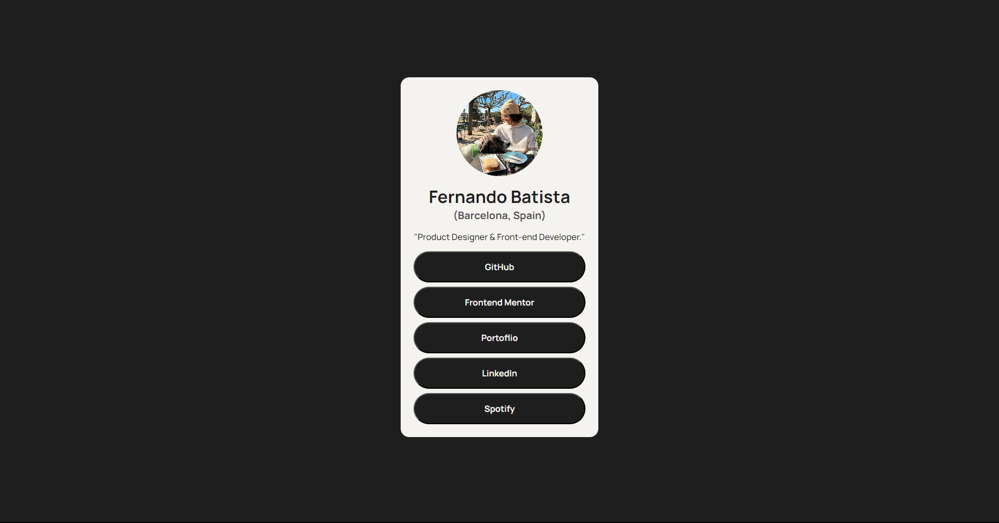

# Frontend Mentor - Social links profile solution

This is a solution to the [Social links profile challenge on Frontend Mentor](https://www.frontendmentor.io/challenges/social-links-profile-UG32l9m6dQ). Frontend Mentor challenges help you improve your coding skills by building realistic projects. 

## Table of contents

- [Overview](#overview)
  - [The challenge](#the-challenge)
  - [Screenshot](#screenshot)
  - [Links](#links)
- [My process](#my-process)
  - [Built with](#built-with)
  - [What I learned](#what-i-learned)
  - [Continued development](#continued-development)
  - [Useful resources](#useful-resources)
- [Author](#author)
- [Acknowledgments](#acknowledgments)


## Overview

### The challenge

Users should be able to:

- See hover and focus states for all interactive elements on the page

### Screenshot



### Links

- Solution URL: (https://github.com/FernJBatista/Social-Links-Challenge)
- Live Site URL: (https://fernjbatista.github.io/Social-Links-Challenge/)

## My process

### Built with

- Semantic HTML5 markup
- CSS custom properties
- Flexbox

### What I learned

It might sound weird, but for this project I wanted to surprise myself and code as much as possible without looking at the final design live. I wanted to test how much I can visualize the code I'm writting and exercise not having to look at the design every 1.6 seconds.


```css
/* First time ever using this sort of color palette. Took it from my own branding to apply it here. I think it made it easier to just pick these, rather than trying to copy the same color code every time and figuring out which is which. */
:root {
    --Isabeline: #F5F3EF; /* Primary Color */
    --Eerie-Black: #1E1E1E; /* Secondary Color */
    --Davys-Gray: #4E4E56; /* Accent Color */
  }
```

### Continued development

I would love to add some sort of movement or extra elements that are interactive, maybe something in the background.

## Author

- Website - [Fernando Batista](https://www.fernando-batista.webflow.,io)
- Frontend Mentor - [@fernjbatista](https://www.frontendmentor.io/profile/yourusername)